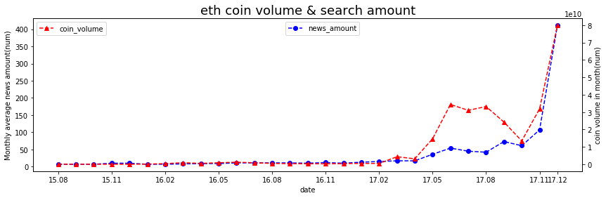
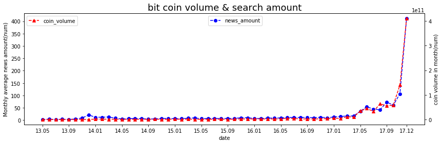

# 가상화폐의 가격과 뉴스 언급량의 상관 관계
## 프로젝트 설명
**일정 기간 동안 "가상화폐, 이더리움, 비트코인, 리플" 키워드가 언급된 기사의 수가 많을 수록 그 기간 동안의 코인 가격의 변동량은 클 것이다.**  
라는 가설을 증명하기 위해 직접 분석해보기.

## 기술 스택
### 파이썬
- BeautifulSoup
- matplotlib

## 결론

기사의 수가 많을 수록 가격의 변동이 컸다. 언급량이 클수록 가격이 올라갔던 것이다.

다만 단순히 기사의 양과 가격 데이터만을 큰 기간으로 나눠서 비교했기에 분석의 질은 굉장히 낮다.

과거에는 단순히 기사의 양만을 비교했지만 기사의 긍정, 부정 정도를 나눠서 척도로 평가한 후 그 정도에 따라 변화량을 분석해 트레이딩 봇을 제작해도 됐을듯.

2018년의 내가 비트코인을 샀었더라면...
